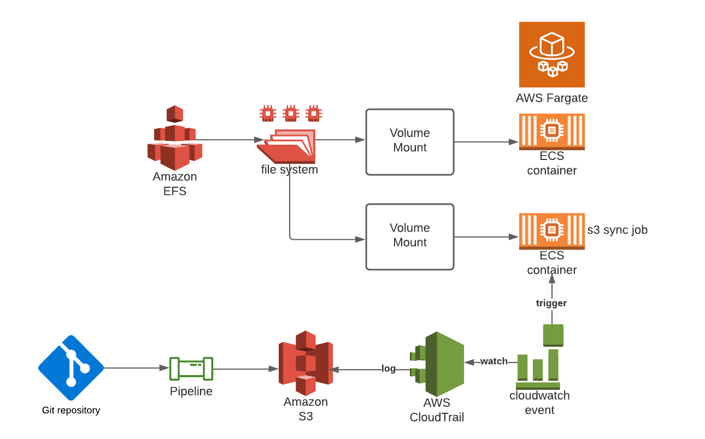

The purpose that developers can upload static contents to the s3 and container will access it directly without rebuilding them inside. The challenge is that AWS doesn't support to mount s3 to the container directly. And EFS does not have good sdk and cli suuport.

To achieve this goal, we create EFS mounted to the container. Every time, when dev pushes new code and then generate new static contents, this will be sync to the s3 bucket in their development pipeline.

We create a AWS cloudtrail to log the write operations on that s3 bucket. Then a cloudwatch event will spin up a ecs container when the desired operation is detected. This ecs container is a job to run s3 sync command. Since this container is mounted with the same EFS, the s3 content is synced to the container as well.

